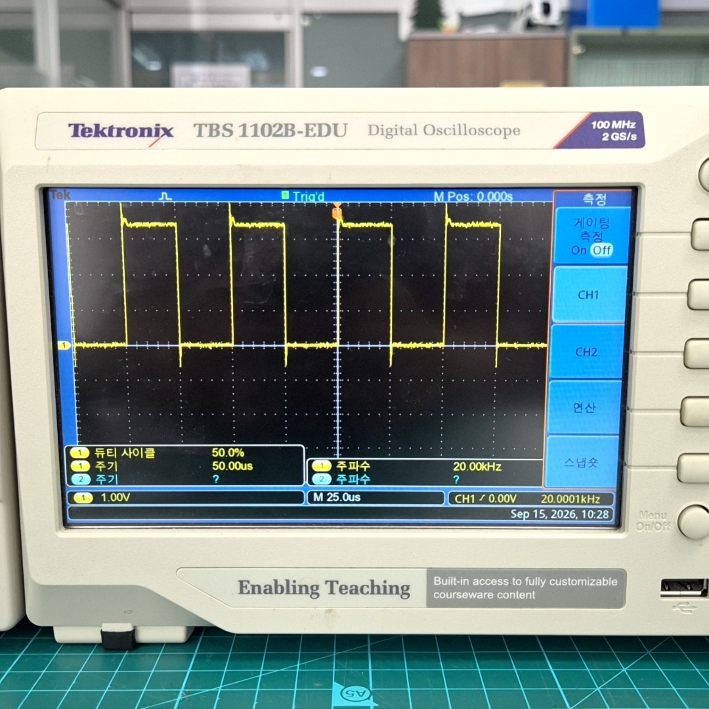
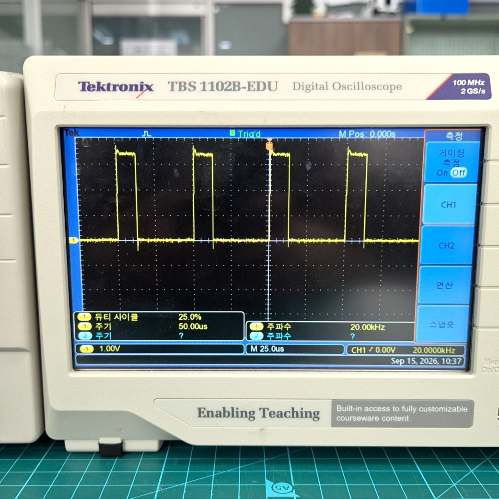
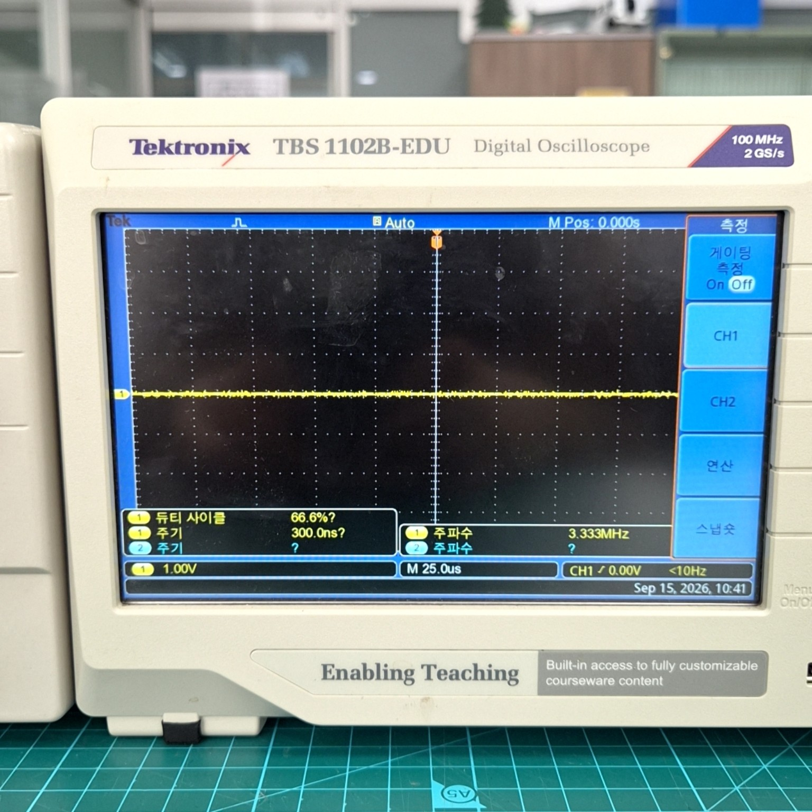

# Project07_VibrationNPU

Zybo Z7-20에서 MPU-6500/9250의 진동 데이터를 수집하고, PL의 64-point FFT와 소형 INT8 NPU로
두 상태를 분류하고 모터 안전 제어와 통합하는 FPGA/SoC 포트폴리오 프로젝트다.

## 구조

```text
MPU-6500/9250 -> SPI -> ARM Cortex-A9
                    |
                    v
              AXI + Dual-port BRAM
                    |
                    v
          FFT64 -> 4-band feature -> 4x4x2 INT8 NPU
                    |                         |
                    v                         v
                  UART          PL safety supervisor
                                  |       |       |
                                warn   25% cap  latched stop
```

- PS: 센서 설정, 64개 sample 수집, BRAM 전송, 가속기 시작, 결과 출력
- PL: radix-2 FFT, 주파수 대역 특징, 2개 MAC PE 기반 MLP 추론
- 별도 모터 출력: L298N에 20 kHz PWM을 제공하고 SW3로 32 Hz 토크 리플 fault injection
- 안전 supervisor RTL: 1회 이상은 warning, 2회 연속은 PWM 25% 제한, 3회 연속은 latch 차단
- PS heartbeat watchdog: ARM 소프트웨어가 100 ms마다 heartbeat를 쓰며 500 ms 단절 시 PL이 독립 차단
- 학습: PC에서만 수행하며 FPGA는 inference만 수행
- HDL: 직접 작성한 Verilog-2001, HDL Coder 미사용

## 검증 결과

| 항목 | 결과 |
|---|---:|
| 실제 데이터 | 정상 3 run 180 window, 토크 리플 3 run 180 window |
| 분리 방법 | run 1/2 학습, run 3 검증; 인접 window 혼합 없음 |
| FP32 검증 정확도 | 99.17% (119/120) |
| INT8 검증 정확도 | 98.33% (118/120) |
| INT8 혼동행렬 | normal 58/60, injected fault 60/60 |
| 독립 C/정수 Golden | 20 window, 2,560 FFT component, 220 result PASS |
| 재학습 전 MATLAB/Simulink | 20/20 PASS |
| 재학습 전 bit 구현 자원 | LUT 10,628, FF 7,270, DSP 5, BRAM 1 |
| 최종 latch bit timing | post-route setup +0.039 ns, hold +0.013 ns, DRC Error 0 |
| Zybo replay (실측 모델) | 100/100 CPU-PL 일치 |
| 실시간 분류 (센서 재고정 후) | 이상 60/60, 정상 28/30, 전체 97.8% |
| 이상 판정 마진 | 최소 117 |
| 실물 센서 | MPU-6500, WHO_AM_I `0x70`, 초기화 PASS |
| 실측 sample 간격 | 998.8 us = 1001.2 Hz, 폐기 window 0건 |
| PL FFT+NPU | 833 cycle = 8.33 us @ 100 MHz |
| NPU 구간 | 18 cycle |
| 가속기 end-to-end | 26.38 us (ARM 소프트웨어 847 us 대비 약 32배) |
| 최종 MATLAB/Simulink | source digest 일치 PASS |
| 안전 확장 XSim | 8/8 PASS, supervisor·watchdog·AXI 회귀시험 포함 |
| 최종 Vitis | safety XSA에 대해 ARM 앱 ELF build PASS. FSBL·BSP는 safety XSA로 재빌드하지 않았고, 실물 기동은 JTAG `ps7_init` + ELF 다운로드 경로라 FSBL을 사용하지 않는다 |
| PL 안전 정지 실측 | 실제 class 1 연속 3회 후 모터 정지, `LD0 OFF / LD1 ON` |
| 차단 전후 전류 | 0.13 A -> 0.01 A |
| clear/rearm | SW0 OFF clear 후 SW0 ON 재회전, 0.13 A |
| 안전 확장 구현 | warning → 25% 제한 → 복구/최종 latch, PS heartbeat watchdog |
| 안전 확장 구현 결과 | setup +0.015 ns, hold +0.031 ns, DRC Error 0 |
| 통제된 리플 완화 경로 | class `1,1,0`: warning → derated bit=1로 25% 제한 상태 → 정상 복구 확인. 레지스터 bit 확인이며 이 시험의 JD1 duty%는 미실측 |
| JD1 duty 오실로스코프 실측 | baseline 50.0% → warning 50.0%(불변) → derate 25.0% → latch 0%(파형 소실) → SW0 clear/rearm 50.0%. 전부 RTL 계산값과 일치 |
| 지속 이상 차단 경로 | class `1,1,1`: warning → 제한 → latch 정지 PASS |
| 안전 확장 차단 전후 | 0.13 A → 0.01 A, SW0 clear/rearm 뒤 0.13 A |
| Watchdog 실물 차단 | ARM 정지 중 모터 차단, `cause=2`, 0.13 A → 0.01 A |

실측 분류의 class 1은 자연 발생 베어링 고장이 아니라 PL이 만든 `25%<->75% @ 32 Hz` 토크 리플이다.
정상 조건은 50% 고정 duty이며 두 조건 모두 12.0 V와 평균 duty 50%를 사용했다. 보드 측정 전체
기록은 [artifacts/hardware_validation_2026-09-14.md](artifacts/hardware_validation_2026-09-14.md)에
있고 원본 CSV는 `measurements/hw_validation_2026-09-14/`에 있다. 안전 supervisor 확장의 bitstream은
`fourier_safety_supervisor.bit` SHA-256 `a57f472a...eb255`, ARM ELF는 SHA-256
`be278a0f...39a21`이다. 확장 실물 결과는
[artifacts/safety_supervisor_hardware_2026-09-15.md](artifacts/safety_supervisor_hardware_2026-09-15.md)에 있다.

최종 실물 시험에서는 정상 class 0을 `3/3` 확인한 뒤 SW3 토크 리플을 입력했다. 판정열
`0,1,1,1,0,0`에서 세 번째 연속 class 1 직후 모터가 정지했고 AXI status `0x004`는
`0x0000000A`로 fault bit 3을 표시했다. `LD0 OFF / LD1 ON`, 전류 `0.13 A -> 0.01 A`를
확인했으며 SW0 OFF clear와 SW0 ON rearm 뒤 모터가 0.13 A로 다시 회전했다.

안전 확장 시험에서는 실제 토크 리플의 class `1,1,0`으로 warning과 25% 제한 뒤 자동 복구를
확인했다. 저장된 실제 이상 window를 동일한 PL FFT/NPU에 3회 연속 통과시킨 class `1,1,1`에서는
warning, 제한, classifier latch 정지를 확인했다. 별도로 Cortex-A9를 JTAG로 정지시켜
`watchdog=1`, `cause=2`로 모터가 0.01 A에서 정지하는 것을 확인했고 SW0 clear/rearm 뒤 0.13 A로
복귀했다. classifier latch 경로의 JD1 duty는 아래 오실로스코프 실측으로 확인했다.

### 오실로스코프 실측 — JD1 PWM duty (classifier latch 경로)

UART `x` 명령으로 저장된 실제 이상 window를 3회 통과시키며 JD1(L298N ENA/PWM)을 프로브로 직접
측정했다. 표시된 duty/period 값은 스코프 화면 그대로이며 RTL의 `pwm_period` 계산값과 전부 일치한다.

| baseline 50.0% | derate 25.0% | latch 0% (파형 소실) |
|---|---|---|
|  |  |  |

latch 상태에서는 더 이상 주기 신호가 없어 스코프의 duty/frequency 자동측정이 `?`로 무효 표시되고
트리거 상태도 `Trig'd`에서 `Auto`로 바뀐다. 이 측정 실패 자체가 PWM이 정적 LOW로 떨어졌다는 증거다.
상세 절차와 표는
[artifacts/safety_supervisor_hardware_2026-09-15.md](artifacts/safety_supervisor_hardware_2026-09-15.md)의
"Oscilloscope confirmation of JD1 duty cycle" 절에 있다.

## 실행

MATLAB Online에서 프로젝트 전체를 업로드한 뒤 실행한다.

```matlab
cd Project07_VibrationNPU
RUN_MATLAB_CHECKS
```

PC 검증과 Vivado 실행:

```text
python3 -m pip install -r requirements.txt
python3 tools/offline_check.py
python3 tools/run.py sim
python3 tools/run.py build
```

실제 MPU-6500/9250 데이터는 독립 run으로 수집하고 분리한다. 수집 명령, 최소 반복 횟수와 재학습 절차는
[docs/REAL_DATASET.md](docs/REAL_DATASET.md)를 따른다.

실측 분류 데이터는 정상 `50%` 고정 duty와 fault injection `25%<->75% @ 32 Hz`를 비교한다.
두 조건의 평균 duty와 전원 전압은 같으며, 이 조건은 자연 발생 베어링 고장이 아니라 PL이 만든
재현 가능한 토크 리플 시험 자극으로 기록한다. SW0은 arm, SW2..1은 정상 duty, SW3는 fault injection,
BTN0은 비상 정지다.

Vivado 2024.2와 Digilent Zybo Z7-20 board files가 필요하다. Vivado가 PATH에 없으면 `VIVADO`에
실행 파일 경로를, 보드 파일을 별도로 설치했다면 `DIGILENT_BOARD_REPO`에 `new/board_files` 경로를
지정한다. Vitis 실행과 UART 명령은 [docs/VITIS_2024_2.md](docs/VITIS_2024_2.md)를 따른다.

## 트러블슈팅: 센서 고정 상태 변화로 인한 이상 검출률 저하

실측 모델을 올린 첫 실시간 측정에서 정상은 60/60 정답이었으나 이상 검출률이 학습 시 98%에서
15%(9/60)로 떨어졌다. 재학습이나 모델 문제로 보이기 쉬운 증상이지만 원인은 연산 경로 밖에 있었다.

배제 과정은 다음과 같다. 첫째, 같은 window에서 CPU와 PL 결과가 60/60 일치했으므로 FFT/NPU
연산 경로와 AXI 전송은 정상이다. 둘째, fault injection RTL(`fourier_motor_control.v`,
`FAULT_HZ=32`)의 마지막 변경 시각이 데이터 수집 시각보다 앞섰으므로 주입 파형 자체가 바뀐 것이
아니다. 셋째, 샘플 간격을 직접 측정해 1001.2 Hz임을 확인했으므로 주파수 축 왜곡도 아니다.

남은 것은 특징 분포였다. four-band feature 평균을 학습 데이터와 대조하니 정상 상태는 거의
같았으나 이상 상태의 에너지가 band 0(16~94 Hz)에서 band 1(109~188 Hz)로 옮겨가 있었다.
원시 스펙트럼에서도 상위 성분이 32 Hz의 1.5~2.5 배음에서 4 배음인 125.2 Hz로 바뀌어 있었다.
모델은 band 0 증가를 이상의 근거로 학습했으므로 이 신호를 인식하지 못한다.

전원을 내리고 센서를 gearbox bracket에 다시 고정한 뒤 같은 조건으로 재측정하니 band 0이
0.98에서 2.90으로 복귀했고 이상 검출률은 60/60 = 100%, 전체 정확도 97.8%, 이상 판정 마진
최소 117이 됐다. 재학습이나 RTL 수정 없이 기계적 전달 경로만 바로잡아 해결한 사례다.

남은 불확실성이 있다. 재고정 직전에 센서가 실제로 느슨했는지는 직접 확인하지 않았으므로
원인은 "고정 상태 변화"로만 기록하고 나사 풀림으로 단정하지 않는다. 재발을 빨리 판별하려면
측정 시작 전에 정상 조건의 four-band feature 평균을 기준값과 비교하는 절차가 필요하다.

## 폴더

| 경로 | 내용 |
|---|---|
| `fourier/rtl` | FFT, NPU, AXI, SPI, 모터 PWM RTL |
| `fourier/tb` | 자동 PASS/FAIL testbench 8개 |
| `fourier/firmware` | ARM 앱과 독립 C 기준 모델 |
| `data` | 학습 데이터, 정수 가중치, test vector |
| `matlab` | MATLAB Golden 및 Simulink 함수 |
| `vivado` | 프로젝트 생성, XSim, bitstream Tcl |
| `tools` | 학습, 검증, UART 실측 데이터 수집 도구 |
| `artifacts` | 통과한 bit/XSA/ELF, 보고서, 보드 측정 결과 |
| `HANDOFF.md` | 다음 작업자가 먼저 읽을 진행 기록 |

실물 배선 전에는 [docs/HARDWARE.md](docs/HARDWARE.md)를 확인한다. 센서 breakout 전압과 L298N
점퍼 상태를 확인하기 전까지 12 V 출력을 켜지 않는다.
